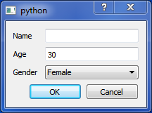

SimpleWidgets
=============

Rapidly build GUI with Python and Qt

## Simple Example

    ```python
    from PySide.QtGui import QApplication
    from simplewidgets.fields import LineTextField, IntField, ChoiceField
    from simplewidgets.simple_widget import SimpleDialog
    
    class DemoDialog(SimpleDialog):
        name = LineTextField(label="Name")
        age = IntField(30, label="Age")
        sex = ChoiceField(["Male", "Female"], initial="Female", label="Sex")
    
    app = QApplication([])
    demo = DemoDialog()
    if demo.exec_accepted():
        data = demo.get_data()
    ```
    
This  code creates the window below. `get_data()` method returns a named tuple with attributes 'name', 'sex' and
  'age' filled according to the user input. 
      


